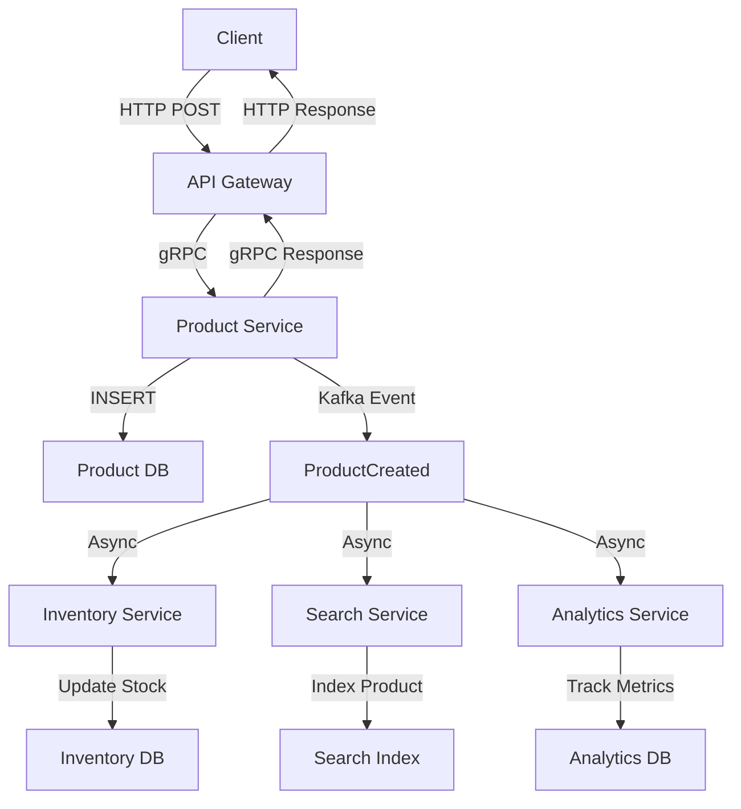
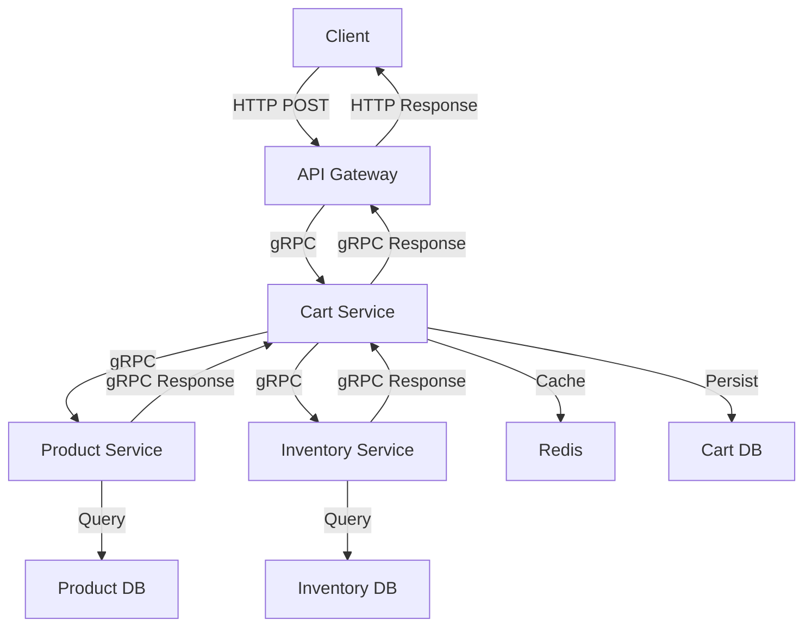
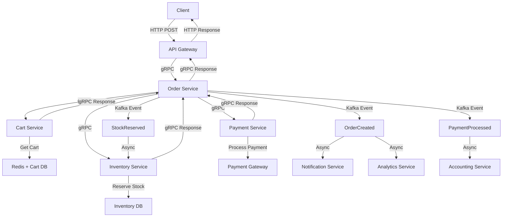

# NestCM Architecture & Flow Patterns

## 🎯 Tổng quan kiến trúc

NestCM sử dụng **Event-Driven Architecture** kết hợp với **Synchronous Communication** để tối ưu hóa performance và scalability.

## 🔄 Communication Patterns

### **1. Synchronous Communication (gRPC)**

**Khi nào sử dụng:**
- **Request-Response patterns** cần immediate feedback
- **Critical business operations** (checkout, payment)
- **Service-to-service calls** với low latency requirements
- **Real-time data validation** (stock checking, user authentication)

**Ví dụ thực tế:**
```typescript
// Product Service gọi Inventory Service để check stock
@GrpcMethod('InventoryService', 'CheckStock')
async checkStock(request: CheckStockRequest): Promise<CheckStockResponse> {
  const stock = await this.inventoryRepository.findStock(request.skuId);
  return { available: stock.quantity >= request.quantity };
}
```

### **2. Asynchronous Communication (Kafka)**

**Khi nào sử dụng:**
- **Event-driven processing** (order created, product updated)
- **Decoupled services** không cần immediate response
- **High throughput messaging** (notifications, analytics)
- **Event sourcing** và audit trail

**Ví dụ thực tế:**
```typescript
// Order Service emit event khi tạo order
@EventPattern('order.created')
async handleOrderCreated(data: OrderCreatedEvent) {
  await this.notificationService.sendOrderConfirmation(data.userId);
  await this.analyticsService.trackOrder(data);
}
```

### **3. Caching & Session (Redis)**

**Khi nào sử dụng:**
- **High-frequency reads** (cart view, product cache)
- **Temporary data storage** (user sessions, rate limiting)
- **Distributed locking** (stock reservation)
- **Real-time counters** (view counts, like counts)

**Ví dụ thực tế:**
```typescript
// Cache cart session trong Redis
async getCart(userId: string): Promise<Cart> {
  const cached = await this.redis.get(`cart:${userId}`);
  if (cached) return JSON.parse(cached);
  
  const cart = await this.cartRepository.findByUserId(userId);
  await this.redis.setex(`cart:${userId}`, 3600, JSON.stringify(cart));
  return cart;
}
```

## 📊 Detailed Flow Diagrams

### **Flow 1: Product Management**



**Technology Stack:**
- **gRPC**: API Gateway ↔ Product Service
- **PostgreSQL**: Product data persistence
- **Kafka**: Event broadcasting
- **Async Processing**: Inventory, Search, Analytics updates

### **Flow 2: Shopping Cart Operations**



**Technology Stack:**
- **gRPC**: Service-to-service communication
- **Redis**: Cart session caching
- **PostgreSQL**: Cart data persistence
- **Real-time**: Stock validation, product info

### **Flow 3: Order Checkout Process**



**Technology Stack:**
- **gRPC**: Critical path operations
- **Kafka**: Event-driven processing
- **PostgreSQL**: Order persistence
- **Redis**: Distributed locking for stock reservation

## 🛠️ Implementation Examples

### **gRPC Service Definition**

```typescript
// product.service.ts
@Injectable()
export class ProductService implements ProductServiceController {
  
  @GrpcMethod('ProductService', 'CreateProduct')
  async createProduct(request: CreateProductRequest): Promise<CreateProductResponse> {
    const product = await this.productRepository.create(request);
    
    // Emit event for async processing
    this.eventEmitter.emit('product.created', {
      productId: product.id,
      name: product.name,
      timestamp: new Date()
    });
    
    return { id: product.id, name: product.name };
  }
}
```

### **Kafka Event Consumer**

```typescript
// inventory.service.ts
@Injectable()
export class InventoryService {
  
  @EventPattern('product.created')
  async handleProductCreated(data: ProductCreatedEvent) {
    // Create default inventory record
    await this.inventoryRepository.create({
      productId: data.productId,
      quantity: 0,
      reserved: 0
    });
  }
  
  @EventPattern('order.created')
  async handleOrderCreated(data: OrderCreatedEvent) {
    // Update stock levels
    for (const item of data.items) {
      await this.inventoryRepository.decreaseStock(
        item.skuId, 
        item.quantity
      );
    }
  }
}
```

### **Redis Caching Strategy**

```typescript
// cart.service.ts
@Injectable()
export class CartService {
  
  async getCart(userId: string): Promise<Cart> {
    const cacheKey = `cart:${userId}`;
    
    // Try cache first
    const cached = await this.redis.get(cacheKey);
    if (cached) {
      return JSON.parse(cached);
    }
    
    // Fallback to database
    const cart = await this.cartRepository.findByUserId(userId);
    
    // Cache for 1 hour
    await this.redis.setex(cacheKey, 3600, JSON.stringify(cart));
    
    return cart;
  }
  
  async addToCart(userId: string, item: CartItem): Promise<void> {
    // Update database
    await this.cartRepository.addItem(userId, item);
    
    // Invalidate cache
    await this.redis.del(`cart:${userId}`);
    
    // Update cache with new data
    const updatedCart = await this.cartRepository.findByUserId(userId);
    await this.redis.setex(`cart:${userId}`, 3600, JSON.stringify(updatedCart));
  }
}
```

## 📈 Performance Considerations

### **gRPC Optimization**
- **Connection pooling** để reuse connections
- **Streaming** cho bulk operations
- **Compression** với gzip
- **Load balancing** với multiple instances

### **Kafka Optimization**
- **Partitioning** theo business keys
- **Consumer groups** cho parallel processing
- **Batch processing** để tăng throughput
- **Retry policies** cho failed messages

### **Redis Optimization**
- **Connection pooling** với Redis cluster
- **Pipeline operations** cho multiple commands
- **Memory optimization** với proper TTL
- **Cache invalidation** strategies

## 🔒 Security & Reliability

### **gRPC Security**
- **TLS encryption** cho service-to-service communication
- **Authentication** với JWT tokens
- **Rate limiting** để prevent abuse
- **Input validation** với protobuf schemas

### **Kafka Security**
- **SASL authentication** cho brokers
- **SSL encryption** cho data in transit
- **ACL policies** cho topic access
- **Audit logging** cho compliance

### **Redis Security**
- **Password authentication** cho Redis instances
- **Network isolation** với private networks
- **Key expiration** để prevent memory leaks
- **Access control** với Redis ACLs

## 🚀 Scaling Strategies

### **Horizontal Scaling**
- **Multiple instances** của mỗi service
- **Load balancers** cho API Gateway
- **Database sharding** theo business domains
- **Cache distribution** với Redis cluster

### **Vertical Scaling**
- **Resource allocation** theo service requirements
- **Database optimization** với proper indexing
- **Memory management** cho caching layers
- **CPU optimization** cho compute-intensive tasks

## 📊 Monitoring & Observability

### **Metrics Collection**
- **Prometheus** cho system metrics
- **Custom business metrics** cho business KPIs
- **Performance indicators** cho response times
- **Error rates** và failure patterns

### **Distributed Tracing**
- **Jaeger** cho request tracing
- **Correlation IDs** cho cross-service requests
- **Performance bottlenecks** identification
- **Service dependency mapping**

### **Logging Strategy**
- **Structured logging** với consistent format
- **Centralized logging** với ELK stack
- **Log levels** theo environment
- **Audit trails** cho compliance

## 🔧 Development Workflow

### **Local Development**
```bash
# Start all services
npm run start:all

# Start specific service
npm run serve product-service

# Generate proto files
npm run proto:generate:all

# Run tests
npm run test:all
```

### **Testing Strategy**
- **Unit tests** cho business logic
- **Integration tests** cho service communication
- **E2E tests** cho complete workflows
- **Performance tests** cho load testing

### **Deployment Pipeline**
- **CI/CD** với automated testing
- **Blue-green deployment** cho zero downtime
- **Feature flags** cho gradual rollouts
- **Rollback strategies** cho failed deployments
