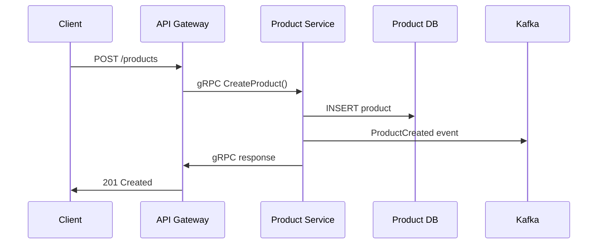
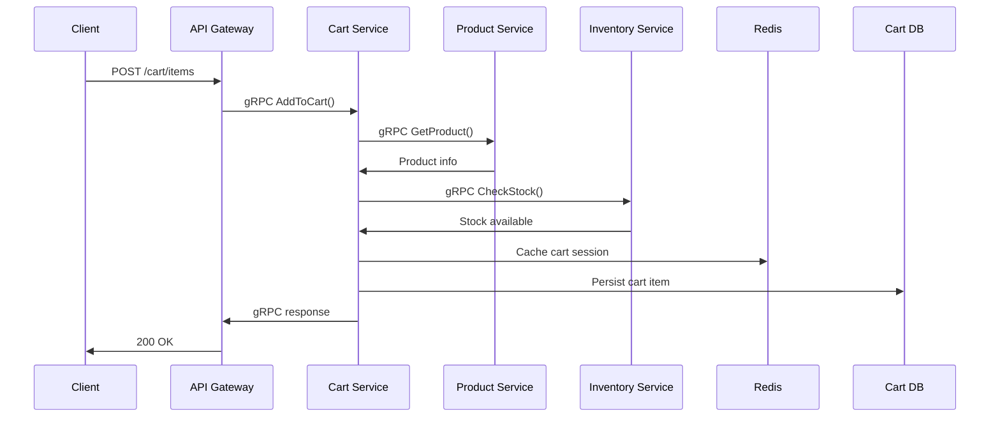
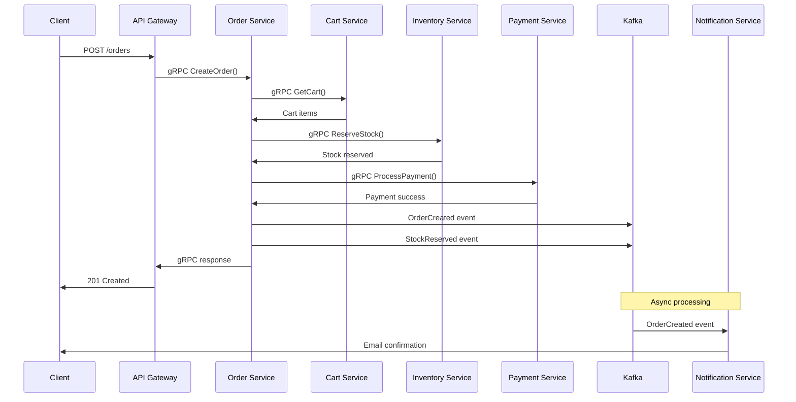

# NestCM - Microservices Architecture

NestCM là một hệ thống microservices được xây dựng bằng NestJS và NX Monorepo, áp dụng kiến trúc "Database Service" với giao tiếp qua gRPC, Kafka và Redis.

## Kiến trúc hệ thống

```
┌─────────────────┐    ┌─────────────────┐    ┌─────────────────┐
│   API Gateway   │    │   Load Balancer │    │   Monitoring    │
│   (Port: 3000)  │◄──►│   (Nginx)       │◄──►│   (Prometheus)  │
└─────────────────┘    └─────────────────┘    └─────────────────┘
         │
         ▼
┌─────────────────┐    ┌─────────────────┐    ┌─────────────────┐
│  Product       │    │  Cart          │    │  Order          │
│  Service       │    │  Service       │    │  Service        │
│  (Port: 3001)  │    │  (Port: 3002)  │    │  (Port: 3005)  │
│  DB: 5431      │    │  DB: 5432      │    │  DB: 5435      │
└─────────────────┘    └─────────────────┘    └─────────────────┘
         │                       │                       │
         ▼                       ▼                       ▼
┌─────────────────┐    ┌─────────────────┐    ┌─────────────────┐
│  Inventory      │    │  User           │    │  Notification  │
│  Service        │    │  Service        │    │  Service        │
│  (Port: 3003)  │    │  (Port: 3006)  │    │  (Port: 3004)  │
│  DB: 5433      │    │  DB: 5436      │    │  DB: 5434      │
└─────────────────┘    └─────────────────┘    └─────────────────┘
```

## Các Services

### 1. **API Gateway** (Port: 3000)
- **Vai trò**: Entry point, routing, authentication, rate limiting
- **Giao tiếp**: HTTP REST API với client, gRPC với các services
- **Database**: Không có (stateless)

### 2. **Product Service** (Port: 3001)
- **Vai trò**: Quản lý sản phẩm, danh mục, thương hiệu
- **Database**: PostgreSQL (Port: 5431)
- **Giao tiếp**: gRPC với API Gateway, Kafka cho events

### 3. **Cart Service** (Port: 3002)
- **Vai trò**: Quản lý giỏ hàng, session
- **Database**: PostgreSQL (Port: 5432) + Redis (cache)
- **Giao tiếp**: gRPC với API Gateway, Redis cho session

### 4. **Inventory Service** (Port: 3003)
- **Vai trò**: Quản lý kho, stock, reservation
- **Database**: PostgreSQL (Port: 5433)
- **Giao tiếp**: gRPC với các services, Kafka cho stock updates

### 5. **Notification Service** (Port: 3004)
- **Vai trò**: Gửi email, SMS, push notifications
- **Database**: PostgreSQL (Port: 5434)
- **Giao tiếp**: Kafka cho event-driven notifications

### 6. **Order Service** (Port: 3005)
- **Vai trò**: Quản lý đơn hàng, thanh toán
- **Database**: PostgreSQL (Port: 5435)
- **Giao tiếp**: gRPC với API Gateway, Kafka cho order events

### 7. **User Service** (Port: 3006)
- **Vai trò**: Quản lý người dùng, authentication
- **Database**: PostgreSQL (Port: 5436)
- **Giao tiếp**: gRPC với API Gateway, Redis cho JWT tokens

## Luồng hoạt động chi tiết

### **1. Luồng CRUD Product**



**Khi nào dùng gRPC:**
- **Synchronous communication** giữa API Gateway và Product Service
- **Real-time responses** cho CRUD operations
- **Low latency** requirements

**Khi nào dùng Kafka:**
- **ProductCreated event** để các services khác biết có sản phẩm mới
- **Inventory Service** cần cập nhật stock
- **Search Service** cần index sản phẩm mới

### **2. Luồng thêm vào giỏ hàng**



**Khi nào dùng Redis:**
- **Cart session caching** để tăng performance
- **Temporary data** không cần persistence ngay
- **High-frequency reads** (xem giỏ hàng)

**Khi nào dùng gRPC:**
- **Service-to-service communication** (Cart ↔ Product, Cart ↔ Inventory)
- **Real-time stock checking**
- **Low latency** requirements

### **3. Luồng mua hàng (Checkout)**



**Khi nào dùng gRPC:**
- **Synchronous operations** (checkout, payment)
- **Real-time responses** cho user
- **Critical business logic** cần immediate feedback

**Khi nào dùng Kafka:**
- **OrderCreated event** để các services khác xử lý
- **StockReserved event** để Inventory Service cập nhật
- **Async notifications** (email, SMS)
- **Event sourcing** và audit trail

## 🛠️ Công nghệ và khi nào sử dụng

### **gRPC - Khi nào dùng:** **Synchronous communication** giữa services   **Real-time responses** cần thiết   **Service-to-service calls** với low latency   **Contract-first development** với protobuf   **Bidirectional streaming** (nếu cần)  

 **Không dùng cho:**
- Event-driven architecture
- Async processing
- Broadcast messages

### **Kafka - Khi nào dùng:** **Event-driven architecture**   **Async processing**   **Message ordering** quan trọng   **High throughput** messaging   **Event sourcing** và audit trail   **Decoupling** services  

 **Không dùng cho:**
- Real-time responses
- Simple request-reply patterns
- Low latency requirements

## **Redis - Khi nào dùng:**
 **Caching** (session, product cache)  
 **High-frequency reads**  
 **Temporary data storage**  
 **Distributed locking**  
 **Rate limiting**  
 **Real-time counters**  

 **Không dùng cho:**
- Persistent data storage
- Complex queries
- Large data sets

## Database per Service Pattern

```
Service          │ Database │ Port │ Purpose
─────────────────┼──────────┼──────┼─────────────────────────
Product          │ PostgreSQL│ 5431 │ Products, categories, brands
Cart             │ PostgreSQL│ 5432 │ Cart items, sessions
Inventory        │ PostgreSQL│ 5433 │ Stock levels, reservations
Notification     │ PostgreSQL│ 5434 │ Notification history
Order            │ PostgreSQL│ 5435 │ Orders, order items
User             │ PostgreSQL│ 5436 │ Users, profiles, auth
```

##  Cách chạy

### 1. **Cài đặt dependencies:**
```bash
npm install
```

### 2. **Chạy tất cả services:**
```bash
npm run start:all
```

### 3. **Chạy từng service:**
```bash
# API Gateway
npm run serve api-gateway

# Product Service
npm run serve product-service

# Cart Service
npm run serve cart-service

# Inventory Service
npm run serve inventories-service

# Notification Service
npm run serve notification-service

# Order Service
npm run serve order-service
```

### 4. **Chạy với Docker:**
```bash
docker-compose up -d
```

## 🔧 Environment Variables

```bash
# Database per Service
PRODUCT_DB_HOST=localhost
PRODUCT_DB_PORT=5431
PRODUCT_DB_NAME=product_db
PRODUCT_DB_USER=postgres
PRODUCT_DB_PASSWORD=password

CART_DB_HOST=localhost
CART_DB_PORT=5432
CART_DB_NAME=cart_db
# ... tương tự cho các services khác

# Redis
REDIS_HOST=localhost
REDIS_PORT=6379

# Kafka
KAFKA_BROKERS=localhost:9092
KAFKA_CLIENT_ID=nestcm

# gRPC
GRPC_HOST=0.0.0.0
GRPC_PORT=50051
```

##  Monitoring và Logging

- **Prometheus**: Metrics collection
- **Grafana**: Visualization dashboard
- **Jaeger**: Distributed tracing
- **ELK Stack**: Log aggregation

## Security

- **JWT Authentication** cho API Gateway
- **gRPC TLS** cho service-to-service communication
- **API Rate Limiting** với Redis
- **Input Validation** với class-validator

## References

- [NestJS Microservices](https://docs.nestjs.com/microservices/basics)
- [gRPC with NestJS](https://docs.nestjs.com/microservices/grpc)
- [Kafka Integration](https://docs.nestjs.com/microservices/kafka)
- [Redis Integration](https://docs.nestjs.com/microservices/redis)

## Contributing

1. Fork repository
2. Create feature branch
3. Commit changes
4. Push to branch
5. Create Pull Request

## License

MIT License - see [LICENSE](LICENSE) file for details
